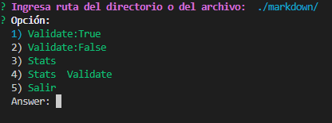
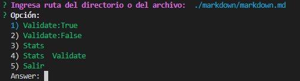
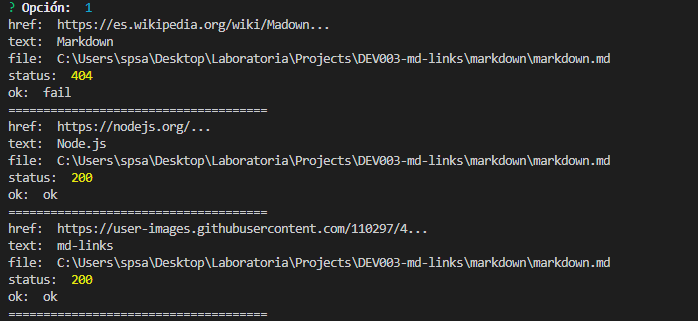
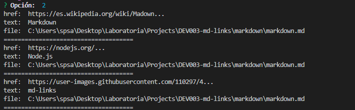
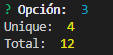
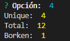

# Markdown Links
*	Este proyecto se realizó siguiendo estas consideraciones [El Proyecto](Readme_proyecto.md "El Proyecto")

## Índice

* [1. Preámbulo](#1-preámbulo)
* [2. Resumen del proyecto](#2-resumen-del-proyecto)
* [3. Objetivos de aprendizaje](#3-objetivos-de-aprendizaje)
* [4. Criterios de aceptación del proyecto](#4-criterios-de-aceptación-del-proyecto)
* [5. Instlación y Uso](#5-instalación-y-uso)
* [6. Consideraciones Generales](#6-consideraciones-generales)

***

## 1. Preámbulo

Markdown es un lenguaje de marcado ligero muy popular entre developers. Es usado en muchísimas plataformas que manejan texto plano (GitHub, foros, blogs, ...), y es muy común encontrar varios archivos en ese formato en cualquier tipo de repositorio (empezando por el tradicional README.md).
Estos archivos Markdown normalmente contienen links (vínculos/ligas) que muchas veces están rotos o ya no son válidos y eso perjudica mucho el valor de la información que se quiere compartir.
Dentro de una comunidad de código abierto, nos han propuesto crear una herramienta usando Node.js, que lea y analice archivos en formato Markdown, para verificar los links que contengan y reportar algunas estadísticas.
 
## 2. Resumen del proyecto
Node.js es un entorno de ejecución para JavaScript construido con el motor de JavaScript V8 de Chrome. Esto nos va a permitir ejecutar JavaScript en el entorno del sistema operativo, ya sea tu máquina o un servidor, lo cual nos abre las puertas para poder interactuar con el sistema en sí, archivos, redes, ...
En este proyecto nos alejamos un poco del navegador para construir un programa que se ejecute usando Node.js, donde aprenderemos sobre cómo interactuar con el sistema archivos, con el entorno (proceso, env, stdin/stdout/stderr), ...
En este proyecto se creó una herramienta de línea de comando (CLI) así como la propia librería (o biblioteca - library) en JavaScript.
Diseñar tu propia librería es una experiencia fundamental para cualquier desarrollador porque que te obliga a pensar en la interfaz (API) de tus módulos y cómo será usado por otros developers. Debes tener especial consideración en peculiaridades del lenguaje, convenciones y buenas prácticas.

## 3. Objetivos de aprendizaje
JavaScript
- [x] Diferenciar entre tipos de datos primitivos y no primitivos
- [x] Arrays (arreglos)
- [x] Objetos (key, value)
- [x] Uso de condicionales (if-else, switch, operador ternario, lógica booleana)
- [x] Funciones (params, args, return)
- [x] Recursión o recursividad
- [x] Módulos de CommonJS
- [x] Diferenciar entre expresiones (expressions) y sentencias (statements)
- [x] Callbacks
- [x] Promesas
- [x] Pruebas unitarias (unit tests)
- [x] Pruebas asíncronas
- [x] Uso de mocks y espías
- [ ] Pruebas de compatibilidad en múltiples entornos de ejecución
- [x] Uso de linter (ESLINT)
- [x] Uso de identificadores descriptivos (Nomenclatura y Semántica)
Node.js
- [x] Instalar y usar módulos con npm
- [x] Configuración de package.json
- [ ] Configuración de npm-scripts
- [x] process (env, argv, stdin-stdout-stderr, exit-code)
- [x] File system (fs, path)
Control de Versiones (Git y GitHub)
- [x] Git: Instalación y configuración
- [x] Git: Control de versiones con git (init, clone, add, commit, status, push, pull, remote)
- [x] Git: Integración de cambios entre ramas (branch, checkout, fetch, merge, reset, rebase, tag)
- [x] GitHub: Creación de cuenta y repos, configuración de llaves SSH
- [x] GitHub: Despliegue con GitHub Pages
- [x] GitHub: Colaboración en Github (branches | forks | pull requests | code review | tags)
- [x] GitHub: Organización en Github (projects | issues | labels | milestones | releases)
HTTP
- [x] Consulta o petición (request) y respuesta (response).
- [x] Codigos de status de HTTP

## 4. Criterios que cumple el proyecto
General
- [x] Puede instalarse via npm install --global <github-user>/md-links

README.md
- [x] Un board con el backlog para la implementación de la librería.
- [x] Documentación técnica de la librería.
- [x] Guía de uso e instalación de la librería

API mdLinks(path, opts)
- [x] El módulo exporta una función con la interfaz (API) esperada.
- [x] Implementa soporte para archivo individual
- [x] Implementa soporte para directorios
- [x] Implementa options.validate
- [x] Agregar la propiedad line a cada objeto link indicando en qué línea del archivo se encontró el link.

CLI
- [x] Expone ejecutable md-links en el path (configurado en package.json)
- [x] Se ejecuta sin errores / output esperado
- [x] Implementa --validate
- [x] Implementa --stats 
- [x] Pruebas / tests
- [x] Pruebas unitarias cubren un mínimo del 70% de statements, functions, lines, y branches.
- [x] Pasa tests (y linters) (npm test).
## 5. Instalación y Uso

**Instalación** 
chrisolivos-mdlinks  
Es un CLI que verifica los links que contienen archivos.md, reporta estadísticas de los links y si estan rotos.

**Instalación via npm** 
$ npm install chrisolivos-mdlinks
 Para acceder se debe importar con require('chrisolivos-mdlinks')

**Instalación via github** 
git clone https://github.com/chrisolivos/DEV003-md-links.git

------------
**API**  
La función mdLinks tiene:

Parámetros
•	path: Ruta absoluta o relativa al archivo o directorio. Si la ruta pasada es relativa, se resuelve como relativa al directorio desde donde se invoca node - current working directory. 
•	options: Un objeto con únicamente la siguiente propiedad: 
-	validate: Booleano que determina si se desea validar los links encontrados. 
-   stats: 

**Valor de retorno**
La función retorna una promesa (Promise) que resuelve a un arreglo (Array) de objetos (Object), donde cada objeto representa un link y contiene las siguientes propiedades:

Con **validate: false**
•	href: URL encontrada.
•	text: Texto que aparecía dentro del link.
•	file: Ruta del archivo donde se encontró el link.

Con **validate: true**
•	href: URL encontrada.
•	text: Texto que aparecía dentro del link.
•	file: Ruta del archivo donde se encontró el link.
•	status: Código de respuesta HTTP.
•	statusText: Mensaje fail en caso de fallo u ok en caso de éxito.

**Guía de uso**

En la línea de comando escribimos: chrisolivos-mdlinks (enter), a continuación nos solicitará la ruta del directorio o archivo.md  

 
A continuación nos mostrará el Menú de opciones para elegir:  
1. Validate: True  
 
2. Validate: False  
 
3. Stats  
 
4. Validate Stats  
 
5. Salir  

## 6. Consideraciones Generales
- [x] La librería y el script ejecutable (herramienta de línea de comando - CLI) estan implementados en JavaScript para ser ejecutados con Node.js. No se usó librerías externas.
- [x] El módulo es instalable via npm install `<github-user>/md-links`. Este módulo incluye tanto un ejecutable que podemos invocar en la línea de comando como una interfaz que podemos importar con require para usarlo programáticamente.
- [x] Los tests unitarios cubren un mínimo del 70% de statements, functions, lines y branches.
- [x] Para este proyecto no se utilizó async/await.
- [x] Para este proyecto fue opcional el uso de ES Modules (import/export).

